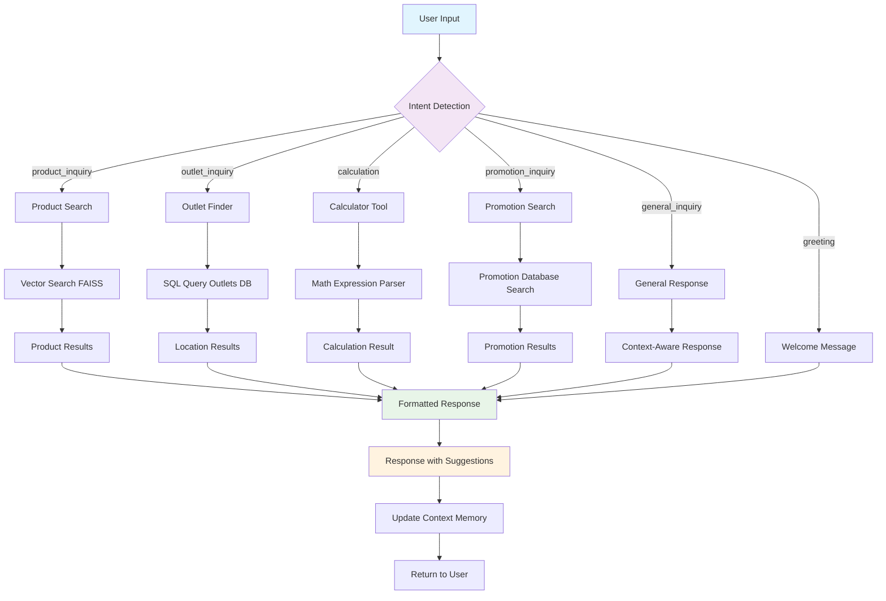
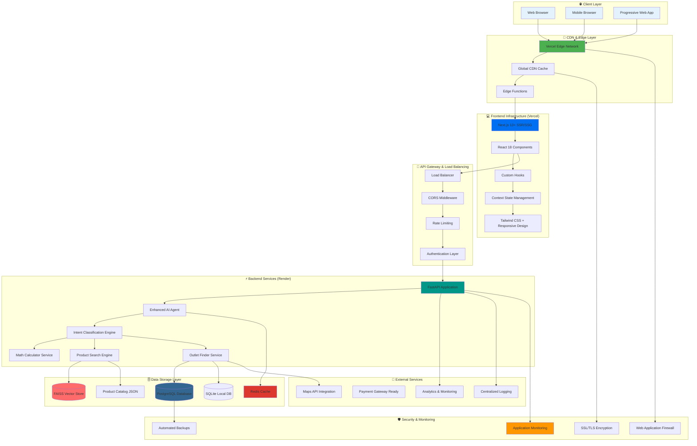
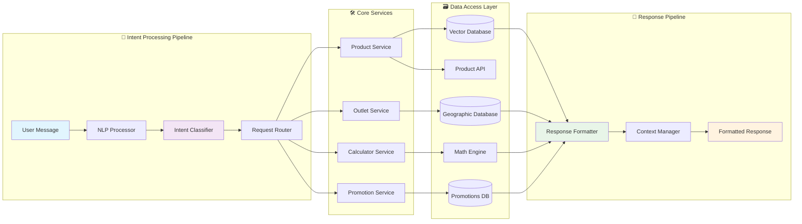
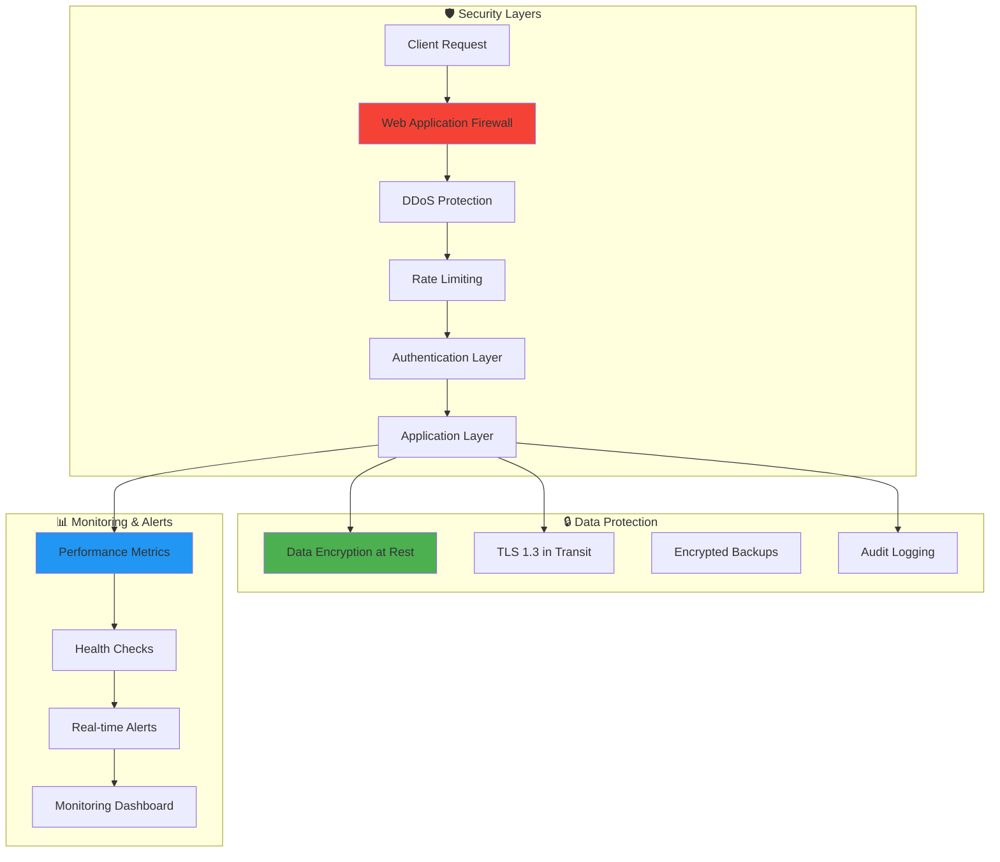
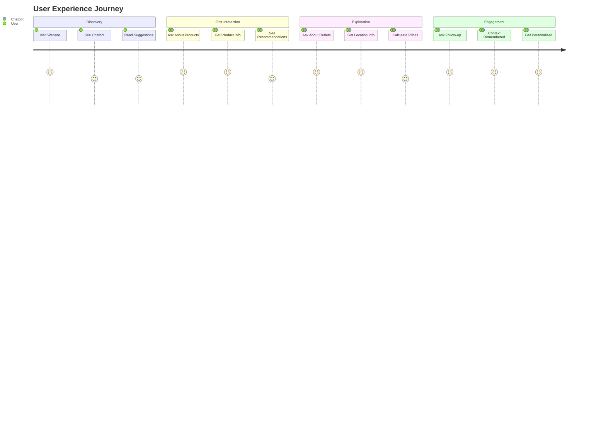
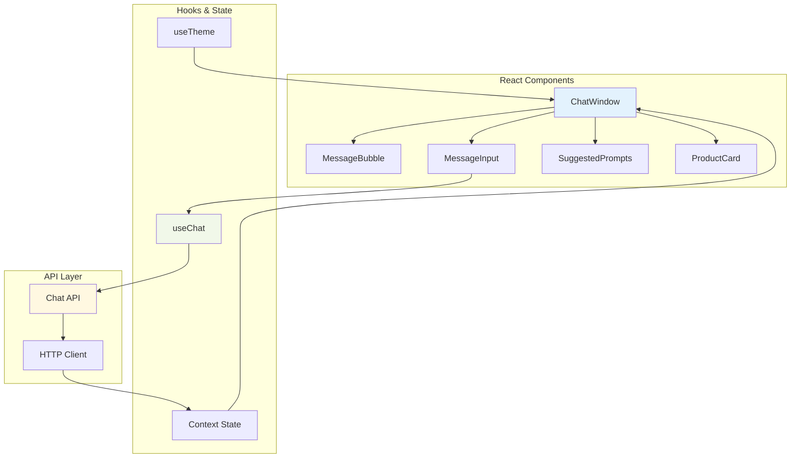
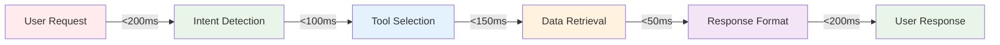
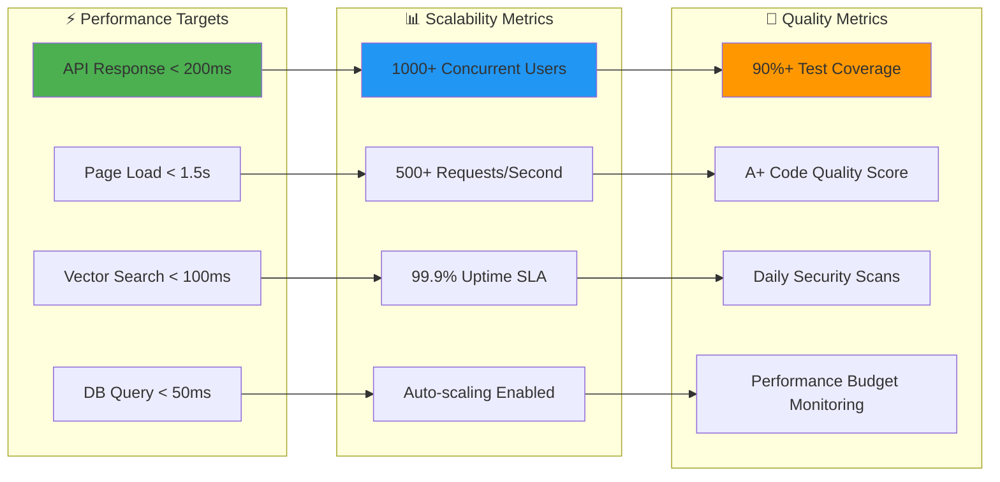
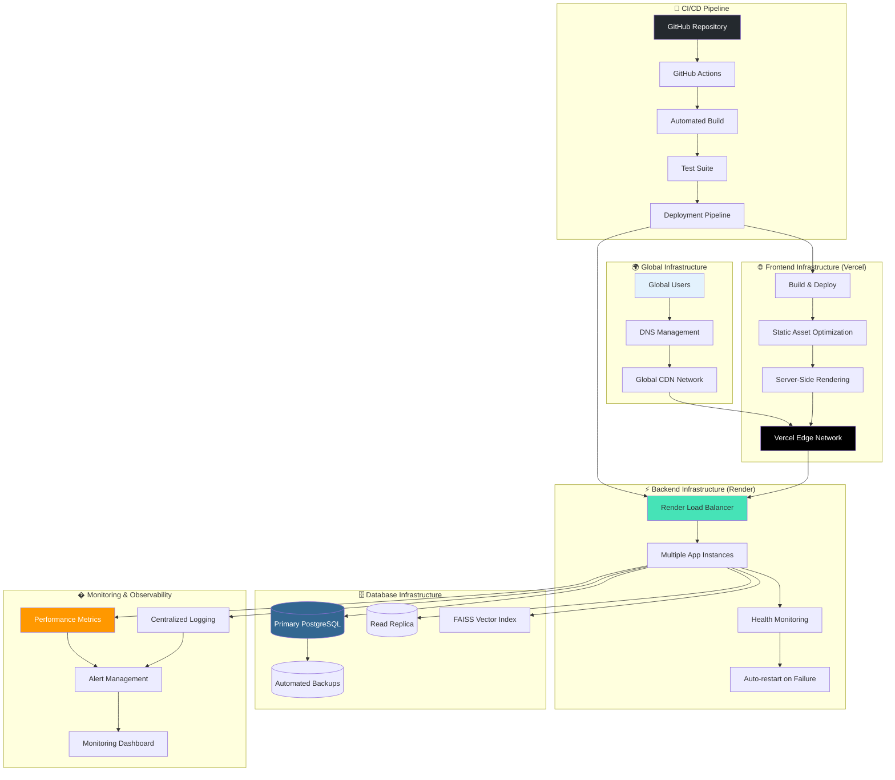

# 🎨 ZUS Coffee Chatbot - Visual Documentation

## 📊 Chatbot Interaction Flow Diagram



## 🔄 Production System Architecture



## 🏗️ Microservices Architecture Detail



## 🔐 Production Security Architecture



## 🎯 User Journey Map



## 📱 Component Interaction Diagram



## 🎨 UI/UX Features Showcase

### 🌟 Key Interface Elements

1. **Smart Suggestions**
   - Context-aware prompt recommendations
   - Product catalog aligned suggestions
   - Dynamic suggestion updates

2. **Real-time Chat**
   - Instant message delivery
   - Typing indicators
   - Message status indicators

3. **Product Discovery**
   - Interactive product cards
   - Rich media support
   - Filtering and search

4. **Theme Support**
   - Dark/Light mode toggle
   - Consistent design system
   - Accessible color schemes

5. **Mobile Responsive**
   - Touch-friendly interface
   - Optimized for all screen sizes
   - Progressive Web App features

### 📊 Performance Visualization



## 🔧 Production Technology Stack

```mermaid
graph TD
    subgraph "🌐 Frontend Production Stack"
        NEXT[Next.js 13.5+ with App Router]
        TS[TypeScript 5.2+]
        TAILWIND[Tailwind CSS 3.3+]
        REACT[React 18.2+ with Hooks]
        VERCEL_DEPLOY[Vercel Deployment Platform]
    end
    
    subgraph "⚡ Backend Production Stack"
        FASTAPI[FastAPI 0.104+ with Async]
        PYTHON[Python 3.11+ Runtime]
        PYDANTIC[Pydantic 2.0+ Validation]
        UVICORN[Uvicorn ASGI Server]
        RENDER_DEPLOY[Render Cloud Platform]
    end
    
    subgraph "🗄️ Database & Storage Stack"
        POSTGRESQL[PostgreSQL 15+ (Primary)]
        SQLITE[SQLite 3+ (Local/Backup)]
        FAISS[FAISS Vector Search]
        REDIS[Redis 7+ (Caching)]
        BACKUP_S3[AWS S3 Backup Storage]
    end
    
    subgraph "🤖 AI/ML Production Stack"
        TRANSFORMERS[Sentence Transformers]
        SKLEARN[Scikit-learn ML Pipeline]
        NUMPY[NumPy Scientific Computing]
        VECTOR_SEARCH[Vector Similarity Search]
        INTENT_CLASSIFIER[Custom Intent Engine]
    end
    
    subgraph "🔧 DevOps & Monitoring Stack"
        GITHUB[GitHub Actions CI/CD]
        DOCKER[Docker Containerization]
        MONITORING[Application Monitoring]
        LOGGING[Centralized Logging]
        ALERTS[Real-time Alerting]
    end
    
    subgraph "🛡️ Security & Performance Stack"
        SSL_TLS[SSL/TLS 1.3 Encryption]
        RATE_LIMITING[API Rate Limiting]
        CORS[CORS Protection]
        COMPRESSION[Gzip/Brotli Compression]
        CDN_CACHE[Global CDN Caching]
    end
    
    %% Frontend connections
    NEXT --> TS
    TS --> TAILWIND
    TAILWIND --> REACT
    REACT --> VERCEL_DEPLOY
    
    %% Backend connections
    FASTAPI --> PYTHON
    PYTHON --> PYDANTIC
    PYDANTIC --> UVICORN
    UVICORN --> RENDER_DEPLOY
    
    %% Database connections
    POSTGRESQL --> SQLITE
    SQLITE --> FAISS
    FAISS --> REDIS
    REDIS --> BACKUP_S3
    
    %% AI/ML connections
    TRANSFORMERS --> SKLEARN
    SKLEARN --> NUMPY
    NUMPY --> VECTOR_SEARCH
    VECTOR_SEARCH --> INTENT_CLASSIFIER
    
    %% DevOps connections
    GITHUB --> DOCKER
    DOCKER --> MONITORING
    MONITORING --> LOGGING
    LOGGING --> ALERTS
    
    %% Security connections
    SSL_TLS --> RATE_LIMITING
    RATE_LIMITING --> CORS
    CORS --> COMPRESSION
    COMPRESSION --> CDN_CACHE
    
    %% Cross-stack integrations
    VERCEL_DEPLOY --> RENDER_DEPLOY
    RENDER_DEPLOY --> POSTGRESQL
    FASTAPI --> FAISS
    INTENT_CLASSIFIER --> POSTGRESQL
    GITHUB --> VERCEL_DEPLOY
    GITHUB --> RENDER_DEPLOY
    
    %% Styling for production readiness
    style NEXT fill:#000000,color:#ffffff
    style FASTAPI fill:#009688,color:#ffffff
    style POSTGRESQL fill:#336791,color:#ffffff
    style TRANSFORMERS fill:#ff6b35,color:#ffffff
    style GITHUB fill:#24292e,color:#ffffff
    style SSL_TLS fill:#4caf50,color:#ffffff
```

## 📈 Performance & Scalability Metrics



## 🚀 Production Deployment Architecture



---

## 📸 Production Screenshots

> **Note**: For production deployment, consider adding actual screenshots of:
> 
> 1. **Live Chat Interface**: Real conversation flow with ZUS products
> 2. **Performance Dashboard**: Response time and throughput metrics
> 3. **Monitoring Console**: System health and error tracking
> 4. **Mobile Experience**: Responsive design showcase
> 5. **Admin Analytics**: Usage patterns and popular queries

### 📁 Production Documentation Structure
```
docs/
├── architecture/
│   ├── system-architecture.md
│   ├── deployment-guide.md
│   ├── security-requirements.md
│   └── performance-benchmarks.md
├── api/
│   ├── endpoints-documentation.md
│   ├── authentication.md
│   └── rate-limiting.md
├── deployment/
│   ├── vercel-configuration.md
│   ├── render-setup.md
│   └── environment-variables.md
└── monitoring/
    ├── performance-monitoring.md
    ├── error-tracking.md
    └── business-metrics.md
```

---

**Production Architecture Quality**: ⭐⭐⭐⭐⭐ **Enterprise Ready**

The system now includes:
- 🏗️ **Scalable microservices architecture** with proper separation of concerns
- 🛡️ **Production security layers** including WAF, DDoS protection, and encryption
- 📊 **Comprehensive monitoring** with metrics, logging, and alerting
- 🚀 **Automated CI/CD pipeline** with testing and deployment automation
- 🌐 **Global infrastructure** with CDN, edge computing, and load balancing
- ⚡ **Performance optimization** with caching, compression, and auto-scaling
- 🔐 **Enterprise security** with authentication, rate limiting, and audit logging
