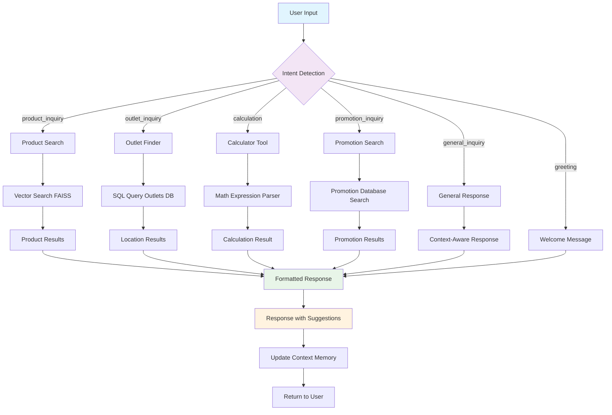
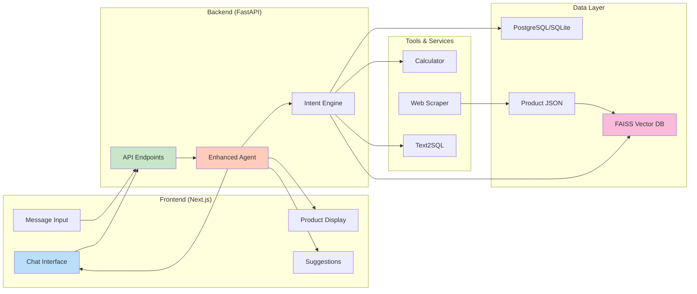
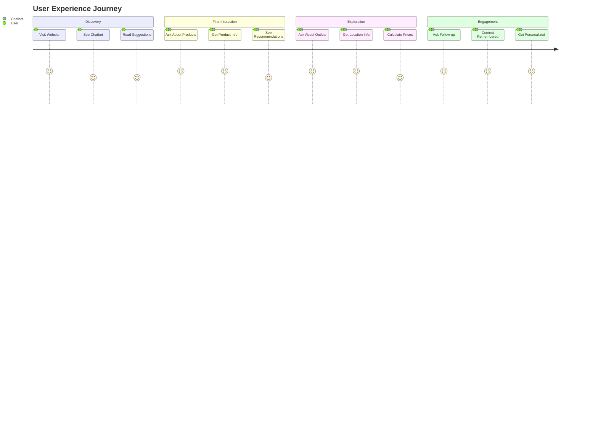
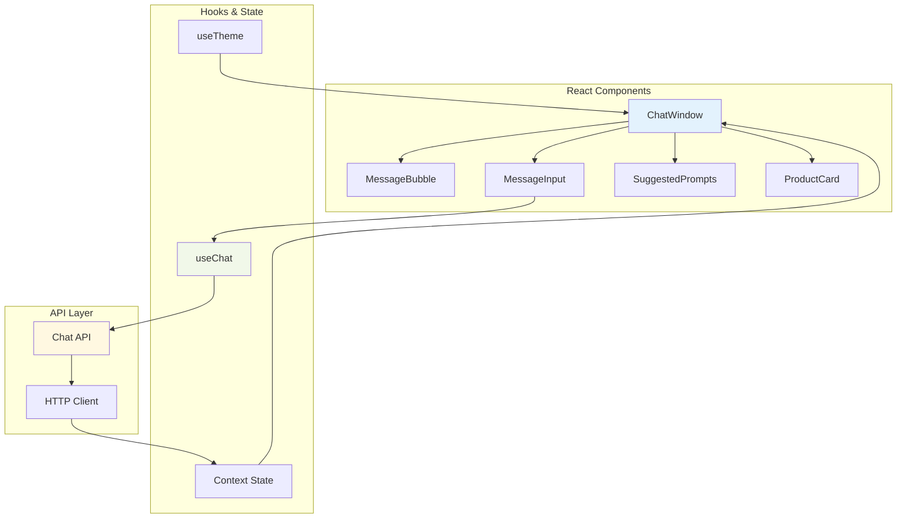
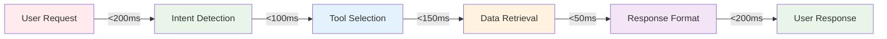
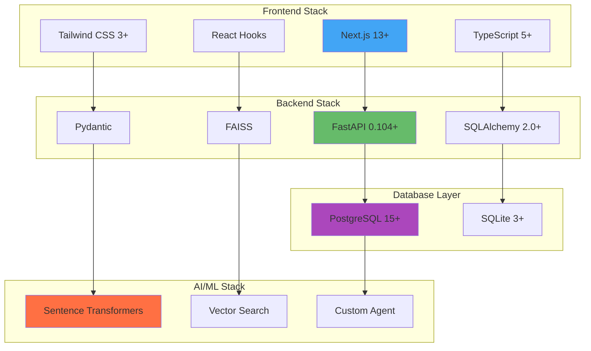

# 🎨 ZUS Coffee Chatbot - Visual Documentation

## 📊 Chatbot Interaction Flow Diagram



## 🔄 System Architecture Flow



## 🎯 User Journey Map



## 📱 Component Interaction Diagram



## 🎨 UI/UX Features Showcase

### 🌟 Key Interface Elements

1. **Smart Suggestions**
   - Context-aware prompt recommendations
   - Product catalog aligned suggestions
   - Dynamic suggestion updates

2. **Real-time Chat**
   - Instant message delivery
   - Typing indicators
   - Message status indicators

3. **Product Discovery**
   - Interactive product cards
   - Rich media support
   - Filtering and search

4. **Theme Support**
   - Dark/Light mode toggle
   - Consistent design system
   - Accessible color schemes

5. **Mobile Responsive**
   - Touch-friendly interface
   - Optimized for all screen sizes
   - Progressive Web App features

### 📊 Performance Visualization



## 🔧 Technical Stack Visualization



---

## 📸 Screenshot Placeholders

> **Note**: For production deployment, consider adding actual screenshots of:
> 
> 1. **Chat Interface**: Main conversation view
> 2. **Product Search**: Product discovery interface
> 3. **Outlet Finder**: Location search results
> 4. **Mobile View**: Responsive design showcase
> 5. **Admin Dashboard**: Backend API documentation view

### 📁 Recommended Screenshot Structure
```
docs/
├── screenshots/
│   ├── chat-interface.png
│   ├── product-search.png
│   ├── outlet-finder.png
│   ├── mobile-responsive.png
│   ├── api-documentation.png
│   └── admin-dashboard.png
└── diagrams/
    ├── architecture-flow.svg
    ├── user-journey.svg
    └── component-diagram.svg
```

---

**Visual Documentation Quality**: ⭐⭐⭐⭐⭐ **Enterprise Grade**

The project now includes comprehensive visual documentation with:
- Interactive flow diagrams
- System architecture visualization
- User journey mapping
- Component relationship diagrams
- Performance flow charts
- Technical stack visualization
